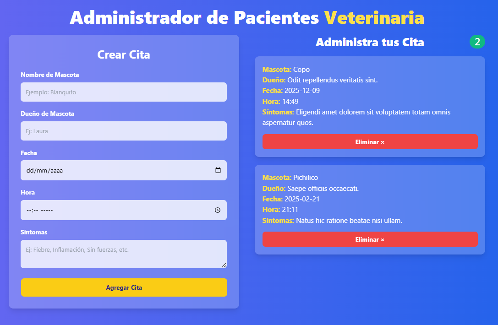

# 🐶 Administrador de Citas Veterinarias con React

   

Este proyecto es una aplicación web (SPA) desarrollada con React que simula un sistema de gestión de citas médicas básicas, enfocado en pacientes veterinarios. La aplicación permite a los usuarios registrar y listar las citas, capturando la información esencial de la mascota, los datos del dueño y los síntomas reportados.

El desarrollo se centró en la práctica de la manipulación de formularios, la gestión de un array de objetos en el estado principal para simular una base de datos de citas, y la renderización dinámica de componentes. Funciona como un CRUD básico (Crear, Listar) esencial para el manejo de colecciones de datos en el frontend.

---
## 🖥️ Vista Previa
A continuación, se muestra una captura de pantalla de la interfaz de la aplicación:


---

## ✨ Características

**Características Principales:**

- **Creación de Citas:** Un formulario permite ingresar los detalles de la cita: nombre de la mascota, dueño, fecha, hora y síntomas.
- **Validación de Formulario:** El sistema valida que todos los campos estén completos antes de permitir la creación de una nueva cita.
- **Listado Dinámico de Citas:** Las citas creadas se muestran inmediatamente en una lista en la pantalla.
- **Eliminación de Citas:** Cada cita en la lista tiene un botón para ser eliminada, actualizando la vista al instante.
- **Persistencia de Datos:** Las citas se guardan en el `localStorage` del navegador, evitando que se pierdan al recargar la página o cerrar el navegador.
- **UI Reactiva:** La interfaz se actualiza automáticamente en respuesta a las acciones del usuario (crear, eliminar) sin necesidad de recargar la página.


## 🛠️ Tecnologías Utilizadas

-   **React**: Biblioteca principal para la construcción de la interfaz de usuario.
    -   **Hooks**: `useState` para el manejo de estado local y `useEffect` para efectos secundarios (como la sincronización con `localStorage`).
-   **Vite**: Herramienta de frontend para un entorno de desarrollo rápido y un empaquetado optimizado.
-   **UUID**: Para la generación de identificadores únicos para cada cita.
-   **CSS**: Estilos personalizados para la interfaz (compatible con frameworks como Skeleton CSS).
-   **LocalStorage**: Para el almacenamiento de datos en el lado del cliente.

---

## ⚙️ Instalación y Puesta en Marcha

Sigue estos pasos para ejecutar el proyecto en tu máquina local:

1.  **Clona el repositorio**
    ```bash
    git clone https://github.com/tu-usuario/mascota-paciente-react.git
    ```

2.  **Navega al directorio del proyecto**
    ```bash
    cd mascota-paciente-react
    ```

3.  **Instala las dependencias**
    ```bash
    npm install
    ```

4.  **Ejecuta la aplicación en modo de desarrollo**
    ```bash
    npm run dev
    ```

5.  Abre tu navegador y visita `http://localhost:5173` (o el puerto que indique la consola).

---

## 📂 Estructura del Proyecto

El proyecto está organizado en componentes reutilizables para una mejor mantenibilidad:
```bash
src/
├── components/
│   ├── Appointment.jsx    # Muestra una cita individual con botón de eliminar
│   └── Form.jsx          # Formulario para crear nuevas citas
├── App.jsx               # Componente principal (orquesta estado y lógica)
└── main.jsx              # Punto de entrada de la aplicación
```

## 🛣️ Hoja de Ruta (Roadmap)

El proyecto está en constante mejora. Estas son las funcionalidades planificadas para el crecimiento del administrador de citas:

- [x] Creación y Listado de Citas: Permitir el registro de nuevas citas y su visualización inmediata en la lista. (Funcionalidad actual)
- [ ] Edición de Citas: Implementar la funcionalidad para seleccionar una cita existente y modificar sus campos (mascota, dueño, síntomas, etc.).
- [ ] Persistencia de Datos: Integrar el almacenamiento con localStorage para que las citas persistan al recargar el navegador.
- [ ] Eliminación Individual: Añadir un botón para eliminar citas específicas del listado y actualizar el estado.
- [ ] Filtrado Dinámico: Agregar campos de búsqueda para filtrar citas por nombre de la mascota o nombre del dueño.
- [ ] Validación Avanzada: Implementar validación de formularios más robusta para asegurar que todos los campos obligatorios sean completados antes del envío.